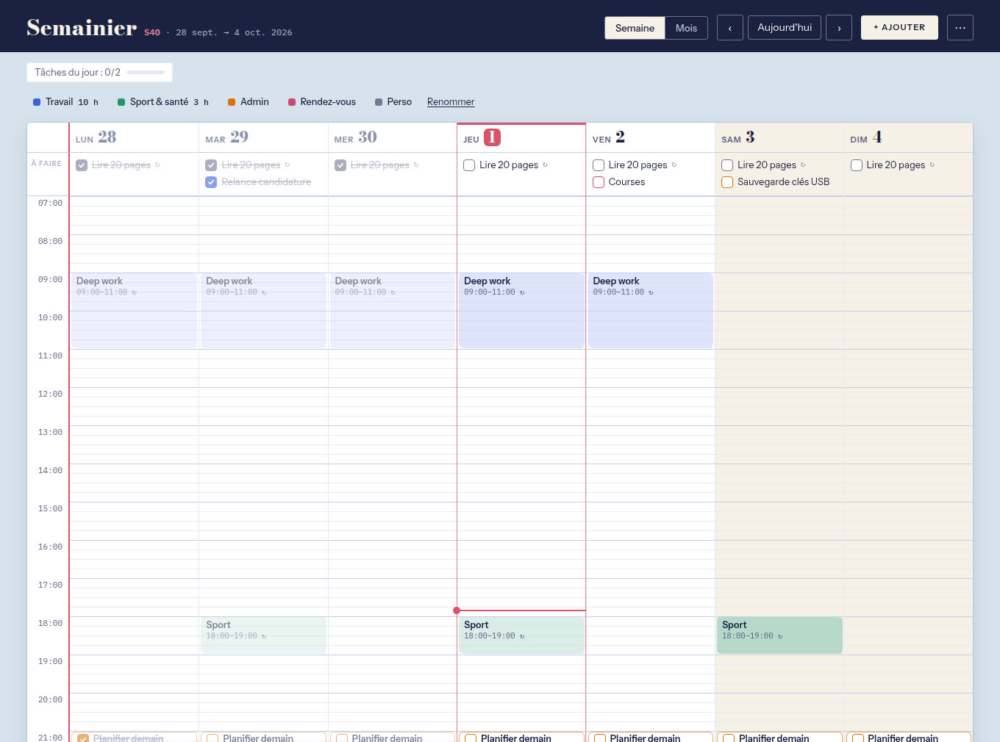
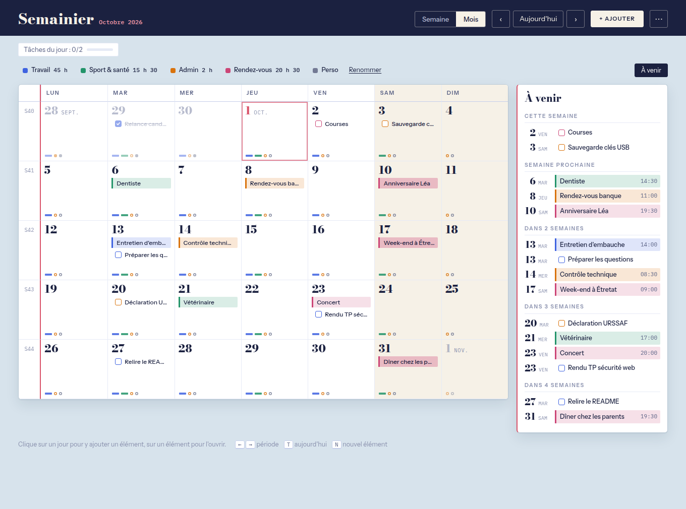
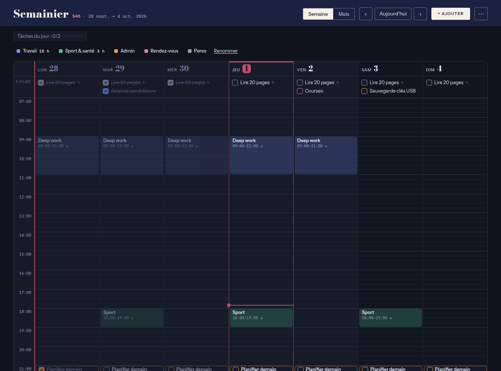
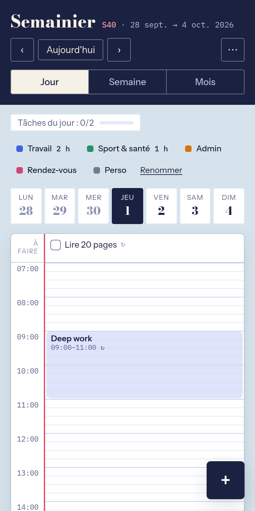
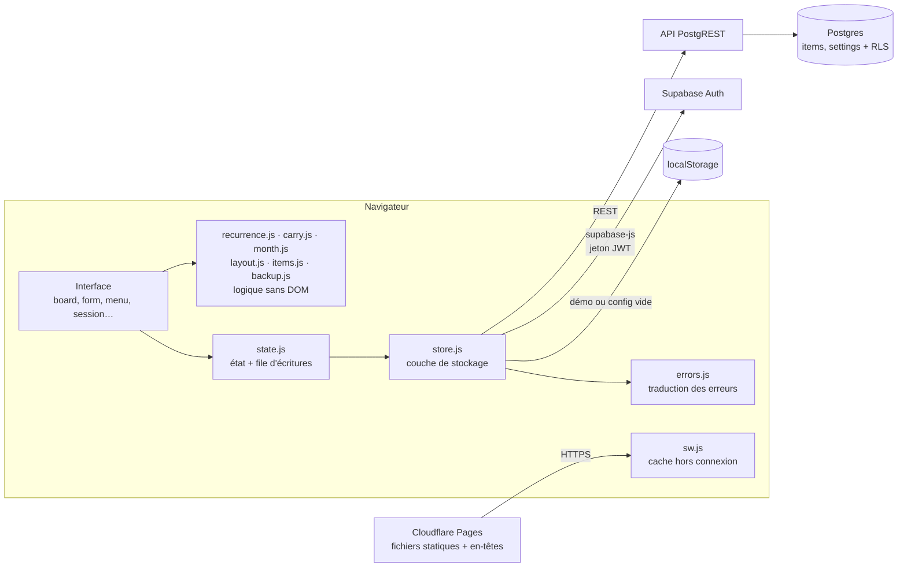

# Semainier

Planning personnel en vue semaine ou mois, pensé comme une page de cahier : on y **bloque des créneaux** et on y **coche des tâches récurrentes** qui se remettent à zéro chaque jour, chaque semaine ou chaque mois.

[](https://semainier-cadgeff.pages.dev/#demo)
[](https://github.com/CadGeff/semainier/actions/workflows/ci.yml)
[](https://securityheaders.com/?q=semainier-cadgeff.pages.dev&followRedirects=on)
[](#stack-technique)
[](#sécurité)
[](#fonctionnalités)
[](LICENSE)

**[→ Essayer la démo](https://semainier-cadgeff.pages.dev/#demo)**, sans compte, avec des données d'exemple stockées dans votre navigateur.



## Pourquoi ce projet

Les outils de planning grand public couvrent soit l'agenda (Google Calendar), soit les listes de tâches (Todoist, Trello), rarement les deux dans une même vue. Il me fallait une page unique pour organiser mes journées en *time blocking* : poser des blocs de travail dans la semaine, avec à côté les tâches qui reviennent (tous les jours, certains jours de la semaine, une fois par mois) et que je coche au fil de l'eau.

J'ai aussi voulu garder la main sur toute la chaîne. Le code, les polices et les bibliothèques sont dans ce dépôt. Les seules briques externes sont l'hébergement statique et Supabase (base Postgres, authentification, API), remplaçables toutes les deux.

## Fonctionnalités

- **Vue semaine** sur une grille au quart d'heure. Sur téléphone (écran de 760 px de large au plus), **vue jour** avec un bandeau pour changer de jour, ou semaine en liste, un jour par ligne.
- **Vue mois** : les éléments ponctuels y sont écrits en toutes lettres, les habitudes (éléments récurrents) réduites à de petites marques de couleur, pour voir d'un coup d'œil ce qui sort de l'ordinaire. Un clic sur un jour ouvre le formulaire à cette date. Sur téléphone, un calendrier à pastilles, et le détail du jour touché en dessous.
- **Liste « À venir »** : les éléments ponctuels des cinq prochaines semaines, regroupés par semaine, dans un panneau à côté du mois, qu'on ouvre ou referme d'un clic. Sur téléphone, elle s'arrête à deux semaines, avec un lien pour la suite.
- **Créneaux bloqués** : un clic sur une case vide ouvre le formulaire d'un créneau à cette heure, avec un aperçu au survol et des durées prêtes à choisir.
- **Tâches à cocher**, avec ou sans heure. Les tâches sans heure vont dans la ligne « À faire » du jour.
- **Récurrence** quotidienne, hebdomadaire (jours au choix) ou mensuelle, sans fin ou jusqu'à une date choisie. Le 31 retombe sur le dernier jour des mois courts. Donner une date de fin à une série l'arrête sans effacer ce qui a été coché. Une série, même de trois jours, reste traitée comme une habitude : de petites marques dans le mois, absente de la liste « À venir », et sa dernière occurrence non faite ne se reporte pas.
- **Refaire** : depuis la fenêtre d'un élément, un clic en crée une copie pour le lendemain (ou pour demain, si l'élément est passé). « Autre date… » ouvre le formulaire prérempli, pour choisir un autre jour ou répéter la copie quelques jours. La copie est un élément indépendant.
- **Chevauchements signalés** : quand un créneau bloqué en recouvre un autre, le formulaire le dit avant l'enregistrement, pour les cinq semaines à venir, et la copie en un clic le dit dans sa confirmation. C'est un signalement et non un refus : la grille place les deux créneaux côte à côte.
- **Report des tâches non faites** : une tâche ponctuelle qui n'a pas été cochée réapparaît le lendemain dans « À faire », sans heure, pendant 7 jours au plus. Elle reste visible à sa date prévue, et la cocher la marque faite partout. Le report est calculé à l'affichage : rien n'est modifié en base tant qu'on ne coche pas.
- **Pour une tâche récurrente, cocher ne vaut que pour le jour même** : l'occurrence suivante revient vierge. On peut aussi retirer un seul jour d'une série sans toucher au reste ; retirer le dernier jour d'une série qui a une fin la supprime, puisqu'il n'en resterait rien à afficher.
- **Catégories nommées** (Travail, Sport & santé, Admin…) : la légende affiche le temps des créneaux bloqués par catégorie, sur la période affichée (jour, semaine ou mois), et un clic sur une catégorie atténue les autres. Les noms sont modifiables et synchronisés entre appareils.
- **Synchronisation entre appareils** : le planning se recharge au retour sur l'onglet, au retour du réseau, et chaque minute tant qu'il reste affiché, sans interrompre une saisie en cours.
- **Repères visuels** : jours passés atténués, jour courant encadré, week-end teinté, ligne de l'heure actuelle, compteur des tâches du jour.
- **Thème Auto, Clair ou Sombre**, vue affichée à l'ouverture et panneau « À venir » ouvert ou non : mémorisés sur chaque appareil. Auto suit le système.
- **Notifications** empilées en bas de l'écran, trois au maximum : une confirmation disparaît seule ; une erreur, le résultat d'un import ou un chevauchement signalé restent jusqu'au clic sur « OK ».
- **Raccourcis clavier** : <kbd>←</kbd> <kbd>→</kbd> pour passer à la période précédente ou suivante (semaine, mois, ou jour sur téléphone), <kbd>T</kbd> pour aujourd'hui, <kbd>N</kbd> pour un nouvel élément.
- **Sauvegarde et restauration** : l'export JSON contient le planning et les noms des catégories ; l'import n'ajoute que ce qui manque, sans doublon. Le menu rappelle quand la dernière sauvegarde faite depuis cet appareil date de plus de 30 jours.
- **Compte** : changement du mot de passe depuis le menu (12 caractères minimum).
- **Double authentification (TOTP) optionnelle**, activable depuis le menu : QR code à scanner avec une application comme Aegis, puis code à 6 chiffres à chaque nouvelle connexion. Elle est imposée par la base de données, pas seulement par l'interface.
- **Application installable (PWA)** : icône sur l'écran d'accueil. Le bouton retour du téléphone ferme la fenêtre ou le menu ouverts au lieu de quitter l'application. Hors connexion, l'interface s'ouvre ; le planning lui-même demande le réseau, sauf en mode local ou démo.



| Mode sombre | Téléphone |
|---|---|
|  |  |

## Stack technique

| Couche | Choix | Pourquoi |
|---|---|---|
| Interface | HTML, CSS et JavaScript natifs (modules ES), sans framework ni build | Le code servi est le code écrit : lisible dans le navigateur, déployé tel quel. Une seule dépendance d'exécution : le client `supabase-js`, copié dans le dépôt. |
| Données et authentification | [Supabase](https://supabase.com) : Postgres, Auth, API REST | Postgres standard et open source, sécurisé par Row Level Security, exportable avec `pg_dump`, auto-hébergeable. |
| Hébergement | Cloudflare Pages | Site statique gratuit, déployé à chaque push, avec de vrais en-têtes HTTP de sécurité (`_headers`). |
| Hors connexion | Service worker, stratégie « réseau d'abord » | Toujours la dernière version en ligne, et l'interface s'ouvre quand même sans réseau (pas les données, qui restent sur le serveur). |
| Ressources | `supabase-js` et polices copiés dans le dépôt | Aucun CDN tiers : pas de fuite d'adresse IP vers Google Fonts, pas de dépendance à la disponibilité d'un CDN. |
| Qualité | ESLint, Prettier, TypeScript (JSDoc), `node:test`, PGlite, Playwright, GitHub Actions | Outils de développement uniquement : rien de tout cela n'est envoyé au navigateur. |

## Architecture



**Une règle, pas des occurrences.** La base stocke chaque élément une seule fois, avec sa règle de répétition. Les occurrences sont calculées à l'affichage par `recurrence.js`, et le report des tâches non faites par `carry.js` : deux modules de fonctions pures couverts par des tests. Deux objets JSON par élément gardent les exceptions : `done`, pour les jours cochés, et `skipped`, pour les jours retirés de la série.

**Démarrage explicite.** Les modules d'interface qui posent des écouteurs exportent une fonction `init…()` appelée par `app.js` : les importer ne pose aucun écouteur et ne déclenche aucun rendu, ce qui rend l'ordre de démarrage explicite. Seule exception, `store.js` choisit le mode de stockage et crée le client Supabase dès son import. La logique métier (récurrence, report des tâches, copie d'un élément, chevauchements, mois et liste « À venir », placement des créneaux, validation des imports, sauvegarde, traduction des erreurs) vit dans des modules sans accès au DOM, testés sous Node sans navigateur.

**Trois modes, une interface.** `store.js` expose les mêmes méthodes (`list`, `save`, `remove`…) dans trois modes : Supabase en production, `localStorage` pour la démo publique (`#demo`), et un mode local quand `config.js` est vide. Il y a deux implémentations, Supabase et `localStorage` ; lectures et écritures passent par les mêmes appels quel que soit le mode. L'interface ne consulte le mode que pour adapter ce qui en dépend : menu du compte, bandeau de la démo, données d'exemple, rappel de sauvegarde, resynchronisation.

### Modèle de données

| Colonne | Type | Rôle |
|---|---|---|
| `id` | `uuid` | Identifiant généré côté client : création et modification passent par le même `upsert` |
| `user_id` | `uuid` | Propriétaire, rempli par défaut avec `auth.uid()` |
| `title` | `text` | Intitulé, de 1 à 120 caractères |
| `kind` | `text` | `block` (créneau bloqué) ou `task` (tâche à cocher) |
| `start_date` | `date` | Première occurrence |
| `until_date` | `date` | Dernier jour d'une série, compris ; vide si elle n'a pas de fin |
| `time_from`, `time_to` | `time` | Horaires : les deux ou aucun, et la fin après le début |
| `recur` | `text` | `none`, `daily`, `weekly` ou `monthly` |
| `days` | `smallint[]` | Jours actifs en hebdomadaire, de 0 (lundi) à 6 (dimanche) |
| `cat` | `text` | Catégorie, parmi cinq couleurs |
| `done`, `skipped` | `jsonb` | Occurrences cochées ou retirées : `{ "AAAA-MM-JJ": true }`. Pour une tâche ponctuelle, `done` retient le jour où elle a été faite |
| `created_at`, `updated_at` | `timestamptz` | Dates de création (ordre d'affichage) et de dernière modification, posées par la base |

Une seconde table, `settings`, contient une ligne par utilisateur avec les noms des catégories (`cat_labels`), sous la même RLS. Les contraintes du tableau (valeurs autorisées, longueurs, cohérence des horaires, heure obligatoire pour un créneau, date de fin réservée aux séries et jamais antérieure au premier jour) sont vérifiées par Postgres lui-même (voir [`supabase/schema.sql`](supabase/schema.sql)). Pour les colonnes JSON, la base vérifie seulement qu'il s'agit d'un objet, et pour `cat_labels` qu'il reste sous 4 ko : le détail de leur contenu est validé par l'application.

## Sécurité

Le dépôt est public et la clé Supabase est visible dans le navigateur, comme dans toute application front-end. La protection des données repose donc sur le serveur ; le navigateur n'apporte qu'une défense en profondeur (CSP, échappement) :

- **Row Level Security** sur les tables `items` et `settings` : chaque requête est filtrée par `auth.uid() = user_id`, en lecture comme en écriture. Un utilisateur authentifié ne peut ni lire, ni modifier, ni s'approprier la ligne d'un autre. Le rôle `anon` n'a aucun droit sur ces tables.
- **Inscriptions désactivées** : le seul compte est créé à la main dans le tableau de bord Supabase.
- **Seule la clé publishable est exposée.** Si `config.js` contient une clé à privilèges (`sb_secret_…` ou `service_role`), l'application n'envoie aucune requête à Supabase : elle affiche l'erreur et retombe en mode local.
- **Content Security Policy** stricte, envoyée en en-tête HTTP, **sans aucune exception `unsafe-inline`** : scripts, styles et polices servis uniquement par le site, aucun script, bloc `<style>` ni attribut `style=""` en ligne (les positions de la grille passent par le CSSOM), requêtes réseau limitées **au site et au seul projet Supabase** de l'application (un script injecté ne pourrait pas envoyer de données à un autre serveur par `fetch`, image ou formulaire ; une CSP n'empêche pas, en revanche, de rediriger la page entière), pas de `<base>`, de formulaire externe ni d'objet embarqué.
- **En-têtes HTTP** (`_headers`) : HSTS, `frame-ancestors 'none'` et `X-Frame-Options` contre le clickjacking (doublés d'une vérification en JavaScript), `nosniff`, `Permissions-Policy` qui coupe caméra, micro, géolocalisation et paiement, isolation `Cross-Origin-Opener-Policy` / `Cross-Origin-Resource-Policy`. L'en-tête CORS ouvert qu'ajoute Cloudflare par défaut est retiré.
- **Double authentification optionnelle, vérifiée côté serveur** : quand un facteur TOTP est actif, une politique RLS *restrictive* exige un jeton de niveau `aal2` sur `items` et `settings`. Un mot de passe volé donne une session `aal1`, qui ne lit ni n'écrit rien, même en appelant l'API directement. La fonction de contrôle vit dans un schéma `private` non exposé par l'API.
- **Sessions** : changer de mot de passe ou activer la 2FA révoque les autres sessions ; « Se déconnecter » ferme la session sur tous les appareils. Si le serveur ne confirme pas la révocation, l'application le signale au lieu d'annoncer un succès.
- **Contraintes SQL** sur les colonnes saisies : énumérations, cohérence des horaires, longueur des titres, type objet des colonnes JSON.
- **Entrées non fiables** : les imports JSON sont limités à 2 Mo et revalidés champ par champ, et tout le texte affiché est échappé.
- **Pas de tiers** : ni CDN, ni polices distantes, ni outil d'analyse d'audience. En-tête `no-referrer`.
- **Vérifié automatiquement**, à chaque exécution de la CI. Côté base, `schema.sql` est appliqué à un Postgres embarqué puis attaqué rôle par rôle : visiteur non connecté, autre utilisateur, session sans code quand la 2FA est active, valeurs hors contraintes. Côté navigateur, les tests de bout en bout contrôlent les en-têtes, l'absence de violation de CSP, le blocage d'un script ou d'un style injecté, le refus d'affichage dans un cadre, l'échappement des titres et le parcours 2FA.

### Modèle de menace

Un planning semble anodin, mais il décrit **où l'on est et quand** : horaires de travail, séances de sport, rendez-vous, absences du domicile. C'est ce qui justifie le niveau de protection, et c'est aussi ce qui en fixe les limites : l'objectif est de rendre une attaque coûteuse, pas de résister à un attaquant étatique.

**Ce qu'on protège**

| Actif | Pourquoi |
|---|---|
| Les éléments du planning | Révèlent routines et absences : utiles pour un cambriolage ou une filature. |
| Le compte Supabase de l'application | Y accéder, c'est lire et modifier tout le planning. |
| Le compte GitHub et le tableau de bord Supabase | Permettraient de modifier le code servi ou les règles de la base. |

**Menaces et parades**

| Menace | Parade en place |
|---|---|
| Quelqu'un lit la clé dans le code source et interroge l'API | La clé publishable ne donne aucun droit : `anon` n'a rien sur les tables, RLS filtre chaque ligne par utilisateur. |
| Création d'un compte pour « entrer » dans l'application | Inscriptions fermées côté serveur. |
| Mot de passe deviné, réutilisé ou fuité | Mot de passe long et unique généré par un gestionnaire ; limitation des tentatives par Supabase ; 2FA optionnelle imposée par RLS. |
| Session restée ouverte sur un appareil perdu | Déconnexion globale, révocation des autres sessions au changement de mot de passe et à l'activation de la 2FA. |
| Injection de script (XSS) via un titre ou un import | Texte toujours échappé, imports revalidés, CSP sans script inline ni domaine tiers. |
| Exfiltration par un script injecté malgré tout | `connect-src`, `img-src` et `form-action` ferment les voies courantes (requêtes `fetch`, images, formulaires) vers un autre serveur. Limite connue : une CSP ne bloque ni la redirection de la page entière ni WebRTC ; la vraie parade reste d'empêcher l'injection. |
| Page affichée dans un cadre piégé (clickjacking) | `frame-ancestors 'none'` et `X-Frame-Options: DENY` ; refus en JavaScript en secours. |
| Bibliothèque compromise sur un CDN | Aucun CDN : `supabase-js` et les polices sont versionnés dans le dépôt. |
| Perte des données (table vidée, projet supprimé par erreur) | Export JSON à la demande, rappel au bout de 30 jours, restauration sans doublon. Pas de sauvegarde automatique : elle obligerait à confier une clé `service_role` à un robot, ce qui contournerait RLS et la 2FA. |
| Clé secrète publiée par erreur dans le dépôt | L'application refuse de se connecter à Supabase avec une clé `service_role` / `sb_secret_` et affiche l'erreur, et GitHub bloque le push des secrets connus. La clé resterait à régénérer : elle serait déjà publique. |

**Pourquoi la 2FA est optionnelle**

Pour un outil ouvert plusieurs fois par jour, un code à chaque connexion est une friction réelle. La session reste ouverte sur les appareils de confiance, donc le code n'est demandé qu'à une nouvelle connexion ; la 2FA protège surtout contre un mot de passe compromis. Elle reste désactivable, et le facteur peut être supprimé depuis le tableau de bord Supabase si l'application d'authentification est perdue.

**Risques résiduels, assumés**

- **Appareil déverrouillé** : quiconque tient un téléphone ou un PC ouvert voit le planning. Le verrouillage de l'appareil reste la première ligne de défense.
- **Jetons en `localStorage`** : un XSS réussi pourrait lire le jeton d'accès et le jeton de renouvellement stocké à côté. La CSP et l'échappement systématique rendent ce scénario très improbable. « Se déconnecter » révoque les jetons de renouvellement sur tous les appareils ; un jeton d'accès déjà émis reste valable jusqu'à son expiration, une heure par défaut.
- **Données en clair côté serveur** : Supabase chiffre le disque, mais un administrateur du projet (ou de Supabase) peut lire les tables. Un chiffrement de bout en bout protégerait de ce cas, au prix d'une clé à gérer sur chaque appareil : la perdre, ce serait perdre le planning.
- **Hébergeur** : Cloudflare voit passer les requêtes vers les fichiers du site (adresse IP, date), mais l'hébergement du site ne voit pas les données du planning, qui vont directement du navigateur à l'API Supabase. Cette API est toutefois elle-même servie derrière le réseau de Cloudflare (ses réponses portent les en-têtes `server: cloudflare` et `cf-ray`) : en tant que prestataire de Supabase, Cloudflare est en position de déchiffrer ce trafic, jeton de session compris. C'est le même niveau de confiance que celui accordé à Supabase, assumé au point précédent. Son réseau ajoute aussi les en-têtes `NEL` / `Report-To` (impossibles à retirer sur une adresse `pages.dev`) : en cas d'échec de chargement, le navigateur lui envoie un rapport d'erreur réseau, sans contenu de page. Le site ne dépend d'aucune fonctionnalité propre à Cloudflare : il se redéploie ailleurs tel quel.
- **Chaîne d'approvisionnement** : une compromission du compte GitHub ou Cloudflare permettrait de servir un code modifié. Parade : mots de passe uniques, 2FA sur GitHub, Cloudflare et Supabase, accès de Cloudflare limité à ce seul dépôt. Les dépendances npm ne servent qu'au développement et ne sont jamais déployées ; les actions GitHub sont épinglées par empreinte de commit et le workflow n'a que le droit de lecture.

## Installer sa propre instance

### 1. Base de données

1. Créer un projet sur [supabase.com](https://supabase.com), de préférence dans une région européenne.
2. Dans **SQL Editor**, exécuter [`supabase/schema.sql`](supabase/schema.sql). Le script est idempotent : on peut le relancer sans risque, et il faut le faire après chaque mise à jour qui le modifie. Il crée ce qui manque et remet en place fonctions, déclencheurs et politiques ; il ne modifie pas une colonne déjà créée. Quand une mise à jour ajoute une colonne, relancer le script **avant** de publier le site : l'ancienne version du site ignore la colonne, la nouvelle en a besoin pour charger le planning.
3. Dans **Authentication → Sign In / Providers**, désactiver *Allow new users to sign up*.
4. Dans **Authentication → Users → Add user**, créer son compte en cochant *Auto Confirm User*.

### 2. Configuration

Récupérer l'URL du projet et la clé **publishable** (bouton **Connect** du projet, ou **Project Settings → API Keys**), puis les renseigner dans `public/config.js` :

```js
window.SEMAINIER_CONFIG = {
  supabaseUrl: "https://<identifiant-du-projet>.supabase.co",
  supabaseKey: "sb_publishable_…"
};
```

### 3. Déploiement

Sur [Cloudflare](https://dash.cloudflare.com), **Workers & Pages → Create application → Pages → Connect to Git**, choisir le dépôt, puis :

| Réglage | Valeur |
|---|---|
| Framework preset | None |
| Build command | *(vide)* |
| Build output directory | `public` |
| Variable d'environnement | `SKIP_DEPENDENCY_INSTALL` = `1` (les dépendances npm ne servent qu'aux tests) |

Chaque push sur `main` redéploie le site, servi à l'adresse `https://<projet>.pages.dev`. Seul le dossier `public/` est publié ; `public/_headers` y est appliqué automatiquement.

Remplacer ensuite l'adresse du projet Supabase dans la directive `connect-src` de la CSP, à deux endroits : `public/index.html` et `public/_headers` (un test vérifie qu'ils restent identiques). Pour lancer les tests de bout en bout, la remplacer aussi dans `tests/e2e/fixtures.js`. Puis, dans Supabase, **Authentication → URL Configuration**, renseigner l'adresse du site.

N'importe quel hébergeur de fichiers statiques convient (Netlify, nginx…) : il suffit de servir `public/`. Sans prise en charge de `_headers`, la CSP de `index.html`, la consigne `no-referrer` et la protection anti-cadre en JavaScript restent actives, mais les autres en-têtes sont perdus.

## Développement

L'application elle-même n'a besoin d'aucune installation : les fichiers de `public/` sont servis tels quels. Avec un `config.js` vide, elle tourne en mode local, avec des données d'exemple au premier lancement. L'outillage demande Node 22 ou plus :

```
npm install                     # outils de développement (une fois)
npm run serve                   # http://localhost:4173, avec les en-têtes de production
npm run check                   # lint + format + types + tests unitaires et de la base
npx playwright install chromium # navigateur de test (une fois)
npm run test:e2e                # tests de bout en bout
```

Après avoir ajouté ou renommé un fichier servi, mettre à jour la liste `SHELL` dans `public/sw.js` et incrémenter `CACHE`. Un test unitaire signale un module de `js/` absent de `SHELL`, et le test hors connexion un fichier listé qui n'existe plus ; aucun test ne rappelle d'incrémenter `CACHE`.

### Publier une version

1. `npm run check` et `npm run test:e2e` passent, et la CI est verte.
2. Relire ce README phrase par phrase contre le code : fonctionnalités, sécurité, modèle de menace, modèle de données. Un test vérifie la section « Structure », les liens et les versions annoncées, mais pas le fond des phrases.
3. Refaire les captures de `docs/` si l'interface a changé.
4. Mettre à jour la version dans `package.json` et `package-lock.json` (`npm version --no-git-tag-version`), poser le tag, publier la release.

## Qualité et tests

Chaque push sur `main` et chaque pull request déclenchent la [CI GitHub Actions](.github/workflows/ci.yml) :

| Étape | Outil | Ce qui est vérifié |
|---|---|---|
| Lint | ESLint | Erreurs courantes, variables inutilisées, `===` obligatoire, pas de `var` |
| Format | Prettier | Mise en forme homogène du code du projet (hors `vendor/`, `config.js`, SQL et Markdown) |
| Types | TypeScript sur annotations JSDoc | Cohérence des types du code de `public/js/`, sans étape de compilation (`jsconfig.json`) |
| Tests unitaires | `node:test` | Récurrence et fin de série, report des tâches, copie d'un élément, chevauchements, mois et liste « À venir », placement des créneaux, cohérence des couleurs, validation des imports, sauvegarde et restauration, traduction des erreurs, cohérence du README avec le dépôt |
| Tests de la base | `node:test` et [PGlite](https://pglite.dev) (Postgres embarqué) | `schema.sql` exécuté pour de vrai : relance et mise à niveau du script, droits de chaque rôle, RLS par utilisateur, 2FA imposée sur `items` et `settings`, contraintes |
| Tests de bout en bout | Playwright (Chromium) | Démo, report des tâches, refaire un élément, fin de série, chevauchements, lisibilité des textes du bandeau et de la page, vues mois et semaine, bouton retour, connexion, mot de passe, 2FA, sauvegarde, sécurité, hors connexion |

Les tests de bout en bout tournent sur le site servi avec ses en-têtes de production, et **simulent Supabase** ([`tests/e2e/fixtures.js`](tests/e2e/fixtures.js)) : aucun test ne touche la vraie base, et la simulation reproduit la politique RLS de la 2FA (aucune donnée sans session `aal2`). Les vraies règles SQL sont testées à part ([`tests/db/schema.test.js`](tests/db/schema.test.js)) sur un Postgres embarqué, où seuls les rôles, le schéma `auth` et le contenu du jeton sont simulés. Ce que ces tests ne couvrent pas : la configuration du projet Supabase lui-même (inscriptions fermées, réglages d'authentification), qui se vérifie dans son tableau de bord. Dependabot propose chaque mois les mises à jour des outils et des actions, validées par la CI avant fusion ; la copie de `supabase-js` dans `vendor/` se met à jour à la main.

## Structure

```
public/                   le site, publié tel quel
  index.html              page unique, CSP
  _headers                en-têtes HTTP de sécurité (Cloudflare Pages)
  styles.css              thème clair et sombre, mise en page
  theme.js                thème et anti-cadre, avant l'affichage
  config.js               URL et clé publishable Supabase
  sw.js                   service worker
  manifest.webmanifest    installation sur l'écran d'accueil
  js/
    app.js                point d'entrée : branchement des modules, clavier
    board.js              grille horaire, légende, choix de la vue, navigation
    views.js              mois, liste « À venir », semaine en liste
    back.js               bouton retour du téléphone
    form.js, detail.js    création / modification, détail d'une occurrence
    menu.js               menu, export / import, rappel de sauvegarde, thème
    categories.js         noms des catégories
    account.js            mot de passe, double authentification
    session.js            connexion, étape du code, chargement, démarrage
    state.js              état et file d'écritures
    store.js              stockage : Supabase, local ou démo
    toast.js              notifications en bas de l'écran
    recurrence.js         dates et récurrence          ┐
    carry.js              report des tâches non faites │
    redo.js               copie d'un élément à refaire │
    month.js              mois et liste « À venir »    │ logique sans DOM,
    layout.js             placement des créneaux       │ testée sous Node
    conflicts.js          chevauchements de créneaux   │
    items.js              modèle, validation, exemple  │
    backup.js             sauvegarde et restauration   │
    errors.js             traduction des erreurs       ┘
    dom.js, ids.js        utilitaires
  vendor/                 supabase-js 2.117.2 (MIT)
  fonts/, icons/          polices (SIL OFL) et icônes
supabase/schema.sql       tables, contraintes, RLS, 2FA
tests/unit/               tests node:test
tests/db/                 règles de la base, sur un Postgres embarqué
tests/e2e/                tests Playwright et simulation de Supabase
tests/server.js           serveur local avec les en-têtes de production
.github/                  CI et Dependabot
types/                    déclarations de types pour la vérification JSDoc
docs/                     captures du README
```

## Feuille de route

- [ ] Glisser-déposer et redimensionner les créneaux à la souris
- [ ] Synchronisation instantanée entre appareils (aujourd'hui : à chaque retour sur l'onglet ou du réseau, et chaque minute tant qu'il reste affiché)
- [ ] Statistiques dans la durée : temps bloqué par catégorie au fil des semaines, taux de réalisation et séries des tâches récurrentes

## Comment ce projet a été réalisé

Le Semainier a été développé avec Claude (Anthropic), utilisé comme binôme de développement.

- **Mon rôle** : définir le besoin et les fonctionnalités, fixer le niveau d'exigence (le projet est parti d'un simple planning personnel ; c'est moi qui ai demandé d'en faire une application sécurisée de bout en bout et un projet de portfolio), arbitrer les choix d'architecture et de sécurité (Supabase et RLS, 2FA imposée par la base, hébergement avec en-têtes HTTP, modèle de menace), tester chaque livraison en conditions réelles et en vérifier le résultat, vérifier les affirmations de l'IA sur l'infrastructure réelle et faire corriger ses erreurs, déployer et administrer l'infrastructure (Supabase, Cloudflare, GitHub) et sécuriser les comptes associés.
- **Le rôle de Claude** : écrire le code, les tests et la documentation, proposer des options et en expliquer les compromis.

Tout le code passe par les mêmes garde-fous à chaque push sur `main` : lint, format, typage du code de l'application, tests unitaires, tests de la base et tests de bout en bout.

## Licence

Code sous licence [MIT](LICENSE). Polices sous licence SIL Open Font License, client `supabase-js` sous licence MIT (voir `public/fonts/` et `public/vendor/`).
